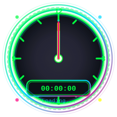
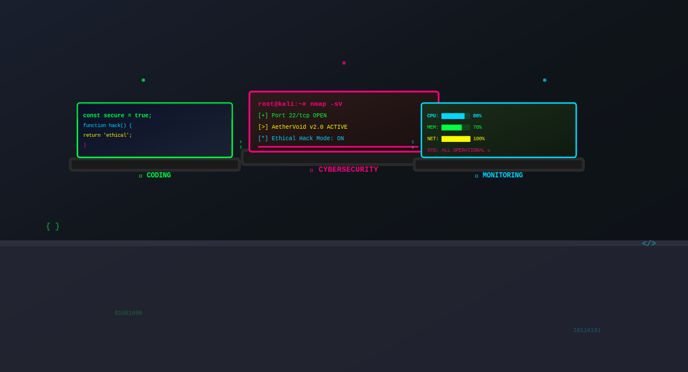

  
  
  
  <!-- Visitor Counter - Unique Feature -->
  

---

  
  <!-- Clock and Stats -->
  

    

      
    

    
  

  
  <!-- Stats -->
  

    
    
  

---

<!-- Workspace -->

  <h2>🖥️ Workspace</h2>
  

    
  

---

<!-- Tech Stack -->

  <h2>⚡ Tech Stack</h2>
  
  

    
    

      <h3 style="color: #00ff41; margin-bottom: 15px;">Frontend</h3>
      

        
        
        
        
      

    

    
    

      <h3 style="color: #00d9ff; margin-bottom: 15px;">Backend</h3>
      

        
        
        
        
      

    

    
    

      <h3 style="color: #ff0080; margin-bottom: 15px;">Database</h3>
      

        
        
        
      

    

    
    

      <h3 style="color: #ffff00; margin-bottom: 15px;">Cybersecurity</h3>
      

        
        
        
      

    

    
  

---

<!-- Projects -->

  <h2>🚀 Projects</h2>
  
  

    
    <!-- AetherVoid -->
    

      <h3 style="color: #00ff41; margin-bottom: 10px;">🔮 AetherVoid</h3>
      
Ethical hacking framework with 150+ tools

      
    

    
    <!-- Portfolio -->
    

      <h3 style="color: #ff0080; margin-bottom: 10px;">💼 Portfolio</h3>
      
Interactive portfolio with modern UI

      
    

    
  

---

<!-- 3D Contribution Graph - Unique Feature -->

  <h2>📊 Contributions</h2>
  

---

<!-- Activity Graph -->

  <h2>📈 Activity Graph</h2>
  

---

<!-- Snake Animation - Unique Feature -->

  <h2>🐍 Contribution Snake</h2>
  

---

<!-- GitHub Trophies - Unique Feature -->

  <h2>🏆 GitHub Trophies</h2>
  

---

<!-- Links -->

  <h2>🔗 Connect</h2>
  
  

    
    
    
    
    
  

  

---

  

